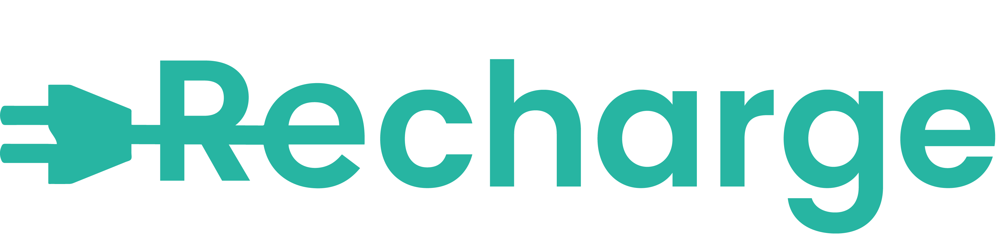
# Design rational
 

## Summary

This document provides an insight into the development of an interactive proof of concept for an application that allows users of charging stations in Amsterdam to report problems that occur when trying to charge their electric car.

---

## Table of contents
- [The team](#the-team)
- [Introduction](#introduction)
    - [The problem](#the-problem)
    - [Proposed solution](#proposed-solution)
- [Concepting phase](#concepting-phase)
    - [Draft](#draft)
    - [Prototype](#prototype)
    - [Wishes and solutions](#wishes-and-solutions)
- [Design phase](#design-phase)
    - [Colors](#colors)
    - [Typography](#typography)
    - [Logo](#logo)
    - [Screens](#screens)
    - [Design review](#screens)
- [Interactive prototype](#interactive-prototype)
    - [Tech stack](#tech-stack)
    - [Database model](#database-model)
    - [Data flow](#data-flow)
    - [Application](#application)
    - [Dashboard](#dashboard)
- [Nice to haves](#nice-to-haves)
    - [Application](#nice-to-haves---application)
    - [Dashboard](#nice-to-haves---dashboard)
- [Recommendations](#recommendations)
- [Conclusion](#conclusion)
---

## The team
The team who build this project consists of three students from the Amsterdam University of Applied Sciences, who identify as designers with a passion for frontend- and backend-development.
- [Tim Ruiterkamp](https://github.com/timruiterkamp) - Focus on backend
- [Dennis Wegereef](https://github.com/denniswegereef) - Focus on frontend
- [Folkert-Jan van der Pol](https://github.com/follywolly) - Focus on frontend

---

## Introduction

This project was initiated by Jurjen Helmus from IDOLaad. The idea stems from the desire to gain more insights in the amount of times people try to charge their electric vehicle at a charging station, but fail to. This data would be valuable to accurately predict the amount of charging stations needed in Amsterdam by 2030 to meet the demand.

The original case description can be found [here](https://drive.google.com/file/d/1fpVQgYPpPrP5GxCdBd7kRcVHn0LEfvgG/view).

### The problem
In the year 2030, the city centre of Amsterdam will only be accessible for electric vehicles. All vehicles using a fossil fuel will be prohibited from entering the city.
More people will travel with electric vehicles, which means there have to be enough charging stations to meet the demand.

The problem with charging stations is that there is a multitude of problems that can occur.
Just a few examples of problems that occur when trying to charge your car at a charging station:
- the charging station doens't work
- the charging station is unreachable
- the charging station is occupied by a non-electric vehicle
- the charging station is occupied for a long time

All these problems cause frustration for people trying to charge their vehicle.
Usually, people want to notify the relevant organizations who are in charge of the charging station.

With this situation and the multitude of possible problems in mind, we encounter a challenge: *Different organizations handle different problems.*

The charging stations in Amsterdam are maintained by private companies. In most cases the charging stations belong to *NUON*. They place the charging station and repair them when they break down.
However, the area the charging station is placed on is usually maintained by the *City of Amsterdam*.

This results in the problem where a user of a charging station tries to submit an issue with the charging station to the 'wrong' organization. The organizations are unaware of each others progress in solving problems at specific charging stations, so they tell the user to reach out to the other organization.

This situation causes even more frustration: the user just wants to notify someone who is in charge about the problem with the charging station, be on their way and maybe later be notified about the status of their submitted issue.

### Proposed solution
IDOLaad is trying to solve this issue by having a proof of concept being made of a charging station user application.
This application will allow users to:
- Submit an issue with a charging station
- Allow a user to check the status of their submitted issue(s)
- Inform the user of nearby charging stations that are operational

## Concepting phase
### Draft
We started by drafting up some wordwebs. First, we started with an overview of what each stakeholder would want:

Then, we drafted up a feature list based on those wishes:

Then we brainstormed about having users log in or not:

Based on this brainstorm we came up with some user goals.

A charging station user should be able to:
- submit an issue with a specific charging station
- feel like they are being listened to
- see current status of their submitted issues
- find an operational charging station

An organization in charge of handling specific problems of charging stations should be able to:
- see all submitted issues relevant for them
- update status of submitted issues that they are supposed to handle
- find the status of an issue that is being handled by a different organization

### Prototype
Based on the featurelist and user/stakeholder wishes we started working on a low-fi prototype, build in adobe XD. It served to lay out the flow the app and dashboard would take and what information would be displayed.

[Client app prototype](https://xd.adobe.com/view/200df57a-f938-47e7-62e4-16f374a24c3d-563c/)
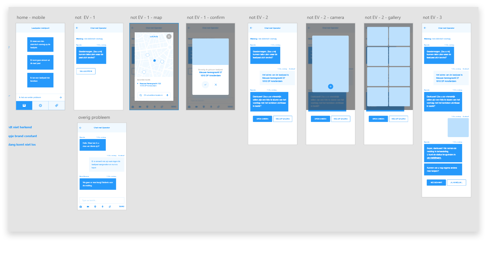

[Dashboard prototype](https://xd.adobe.com/view/200df57a-f938-47e7-62e4-16f374a24c3d-563c/)
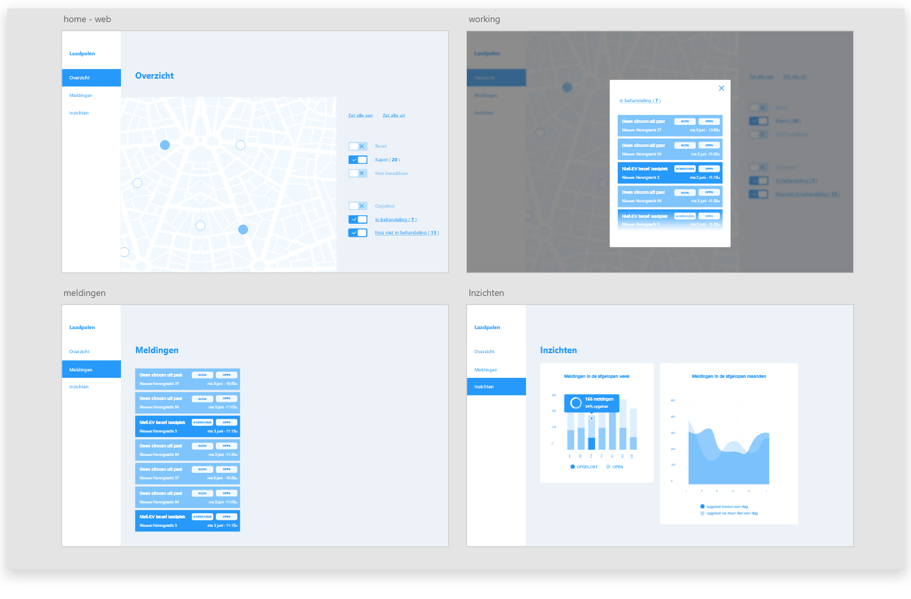

### Wishes and solutions
#### User doesn't know what organization to submit a problem to
We quickly decided that we could tackle the frustration of a user submitting a problem to the wrong organization. The most common problems will be build into the app. A user is then taken through a chat-like flow which guides the user through the necessary information needed for an organization to start working on the issue.
Every flow is associated with a specific organization. This way, the user doesn't have to figure out what organization to turn to.

#### User wants to be heard
Since we now took the most common problems and make a chat-like flow based on the necessary information needed to handle the problem, the user gets the feeling that they actually are being listened to as opposed to filling in a form.

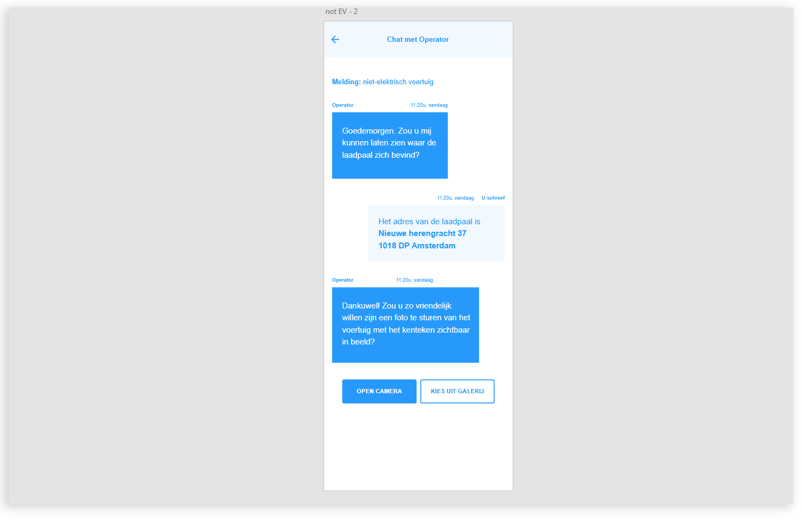

#### User wants to be aware of status updates of their submitted issues
When a user submits an issue, it will end up with their other submitted issues in their issue tab. Here, the user can check the status of their submitted issues.

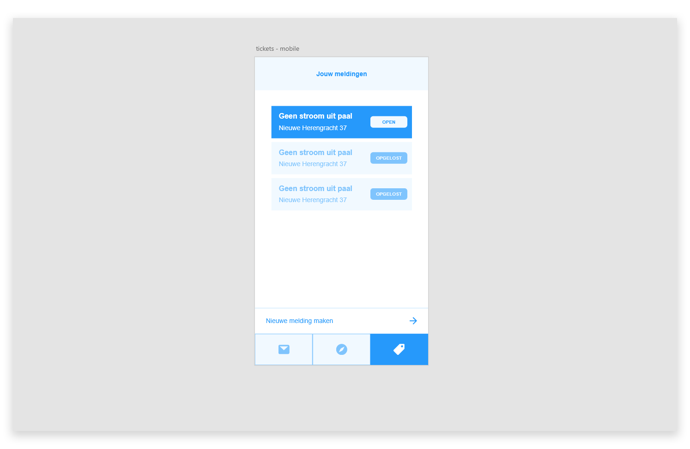

#### User wants to be recommended a different charging station
In most cases when a user submits an issue, the next logical step to take is to find a working charging station. The user was most likely trying to charge their vehicle after all.
So, we decided to put a map in the prototype that shows all charging stations near you and their current status.

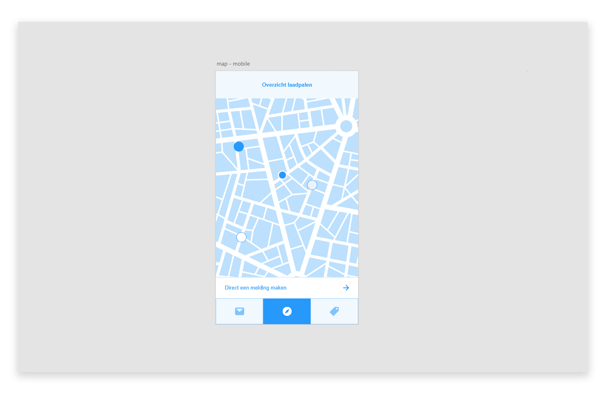

#### Organization wants to see relevant issues
In the dashboard organizations will be able to see all current issues. They will see their issues (in image below they're in a darker color than other issues) The status of all issues is shown along with the address of the charging station and the description of the issue.
They will also see the issues other organizations should handle.

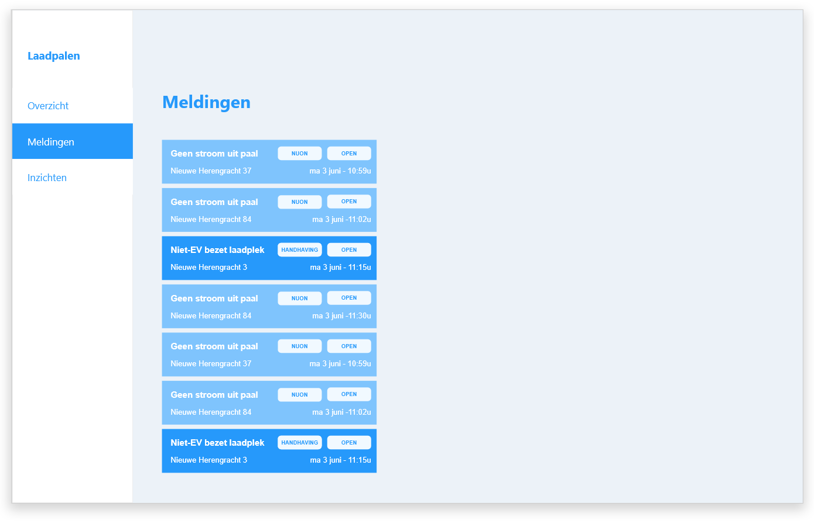

#### Organization wants to be aware of the status of issues that should be handled by other organizations
As stated above, all issues will be displayed in the dashboard regardless of what organization you are.
As addition to the list of issues we decided to implement a map that will show all charging stations and their status.

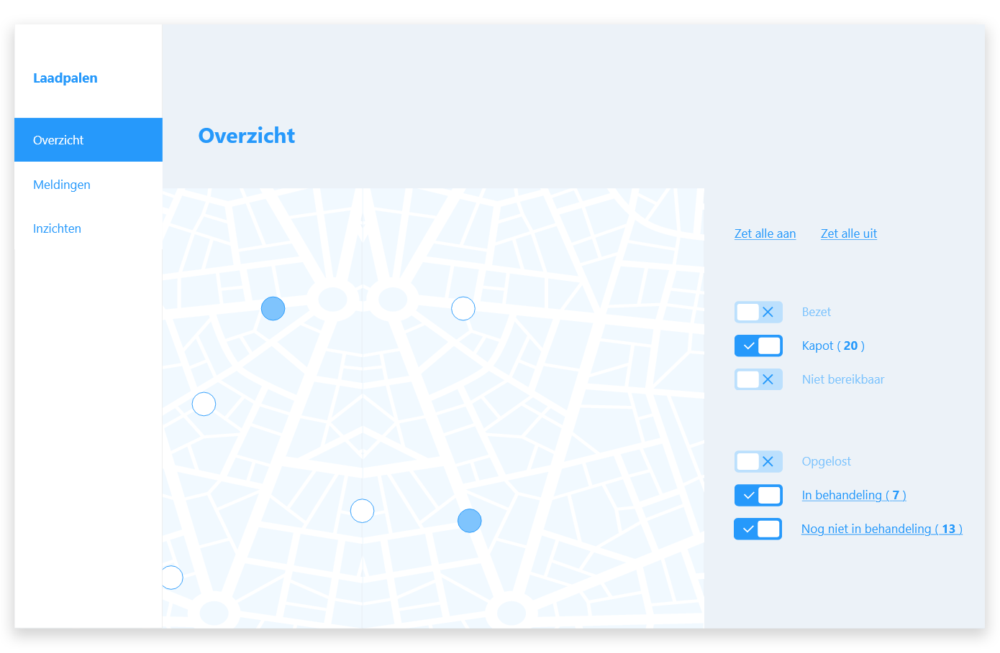

#### Added: insights
Since this project focusses heavily on dataflow and data, we decided it could be a nice feature for the charging station organizations to be able to gain insights from data.
We added some graphs as an example of what data could be shown to give them idea of the possibilities if this project sees the light of day.

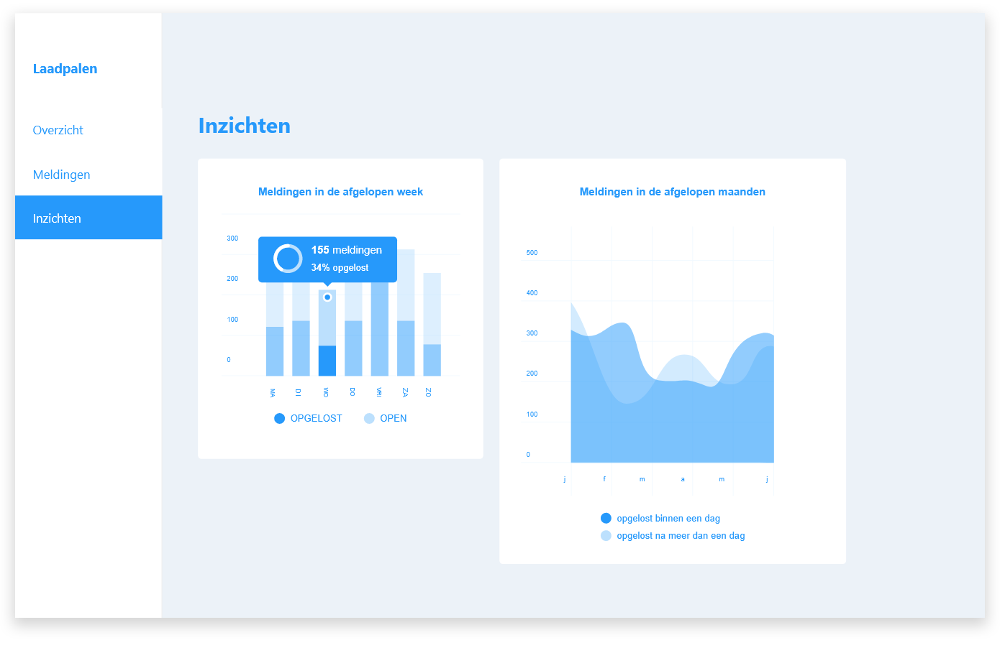

---

## Design phase
While working on the wireframes we started making a styleguide for the project.

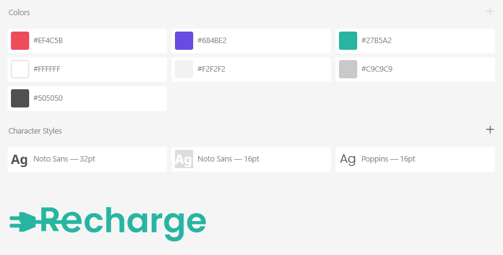

### Colors
We decided to take one primary color, green, in this case #27B5A2.
The green will be used as a background color for main buttons, fullscreen splash pages and headers.
We chose green because it signals green energy, which fits with the subject of charging stations for electric vehicles.

For the status of issues we wanted to be able to signal the status with colors as well. For this we chose a desaturated red and blue, complementing the green. Red will signal urgency in the dashboard and out of order on the app. Blue will signal an issue is being worked on and serves as a secondary color for some actions.

### Typography
We wanted to keep the typography clean and modern, fitting with the futuristic feeling of electric vehicles. We wanted to make clear distinctions between headings and default text font for clearer visual hierarchy which allows quick scanning of the pages to find what you are looking for, which is especially useful for submitting an issue for users.
Poppins is used for main text and Noto Sans is used for buttons and headings.

### Logo
The logo is based on the logo of Amsterdam Elektrisch, the institution of the City of Amsterdam that provide information about electric vehicles and make sure charging stations are being placed.
It's combined with the name of the application, Recharge. The name stems from submitting an issue when charging fails, and organizations handling these issues and solving them, thus recharging the charging station.

### Screens
With these styles set in place and our wireframe prototype in the works we started implementing the style into the wireframes.

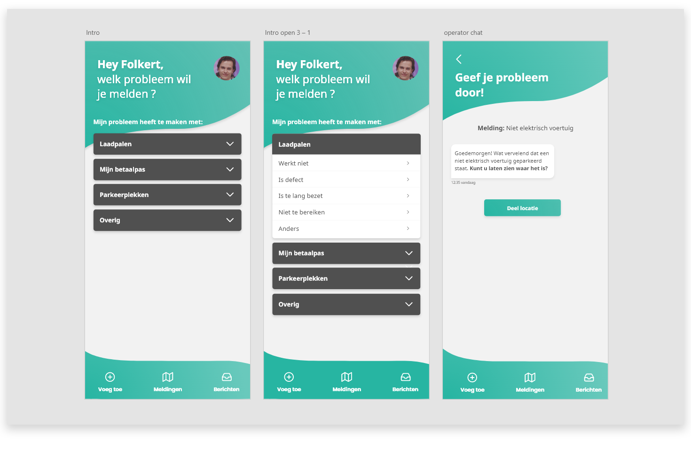
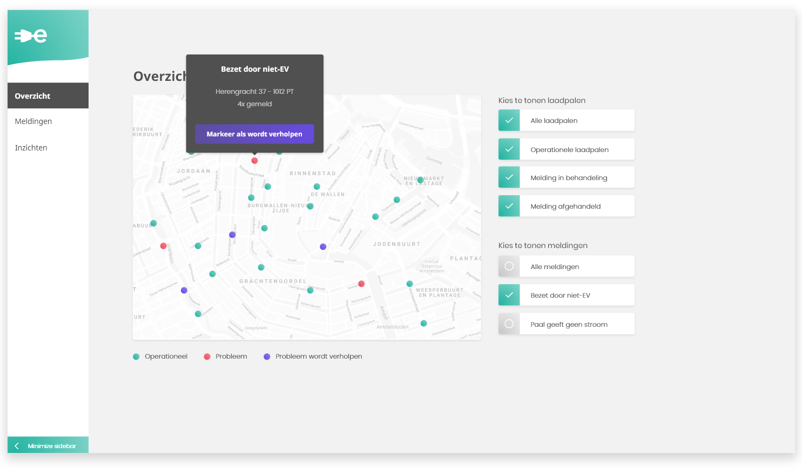

### Design review
We've had a design review by [Joop Akerboom](https://github.com/joopakerboom) & [Matthias Leuhof](https://github.com/matthiasleuhof).
In the first design we still had some sort of wave going on in the headers of the pages, and it came up that there wasn't really a good reason for us to have that in our design, so we decided to scrap it.
They also commented on making more use of available space in both the application and the dashboard, so we increased some sizes where it felt justified.
Overall though, they were very impressed.

---

## Interactive prototype

After applying the styles to all the wireframes we started building the interactive prototype.

### Tech stack
We quickly decided to make the frontend with [Vue](https://vuejs.org/). To improve performance by rendering the application server-side, we decided to use the server-side version of Vue called [Nuxt](https://nuxtjs.org/).

We needed an API to fetch data and enable real-time communication between dashboard and app on different devices, so we made an API with [NodeJS](https://nodejs.org/en/).
A database was necessary for the data about charging stations and issues. We decided to use [MongoDB](https://www.mongodb.com/), and used [GraphQL](https://graphql.org/) to communicate with it.

We made a seperate NodeJS server for the API and for the dashboard / app. This allowed for a nice seperate workflow without getting lost in filestructure.

For the real-time communication we used Socket.IO.

#### Overview of technologies used
##### Frontend:
- [Nuxt](https://nuxtjs.org/)

##### Backend:
- [NodeJS](https://nodejs.org/en/)
- [GraphQL](https://graphql.org/)
- [MongoDB](https://www.mongodb.com/)

### Database model
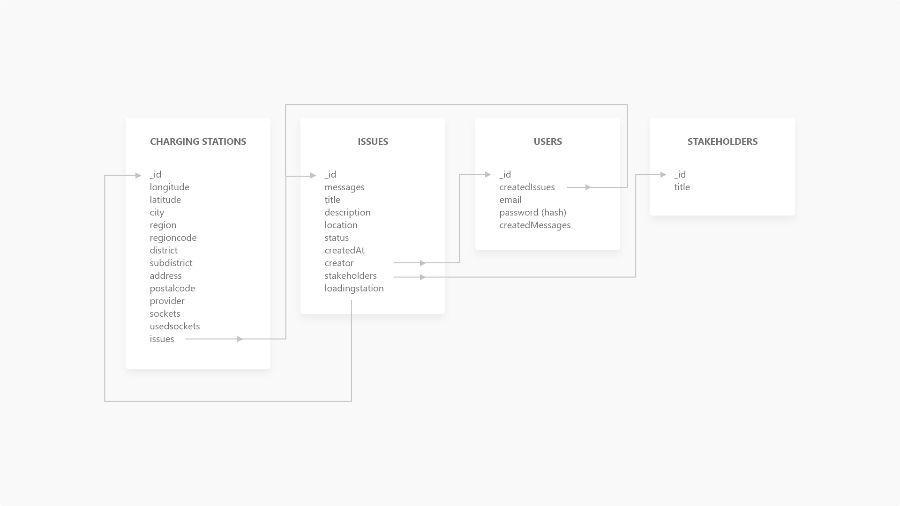

### Data flow
An overview of how data flows through our application, in this case a user submitting an issue and an issue's status being updated by an organization via the dashboard.

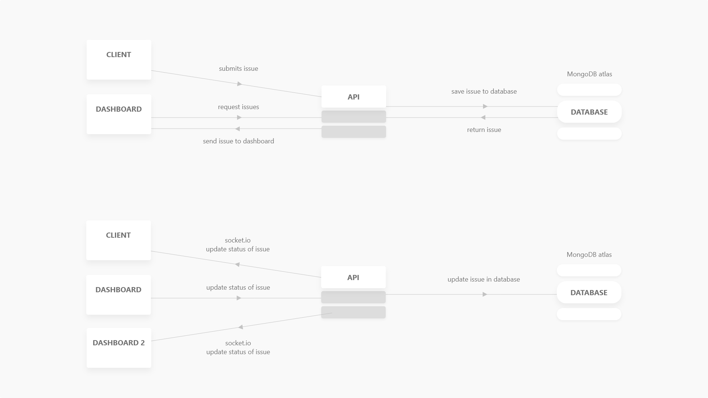

### Application
#### Flow of submitting an issue
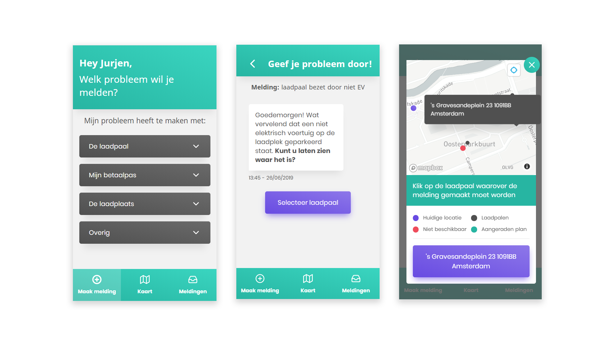
From left to right:
1. User can choose from most common problems and pick one.
2. Chat flow for specific problem opens and asks for specific information based on the problem
3. User can interact in a natural and quick way to provide information necessary

#### Other screens
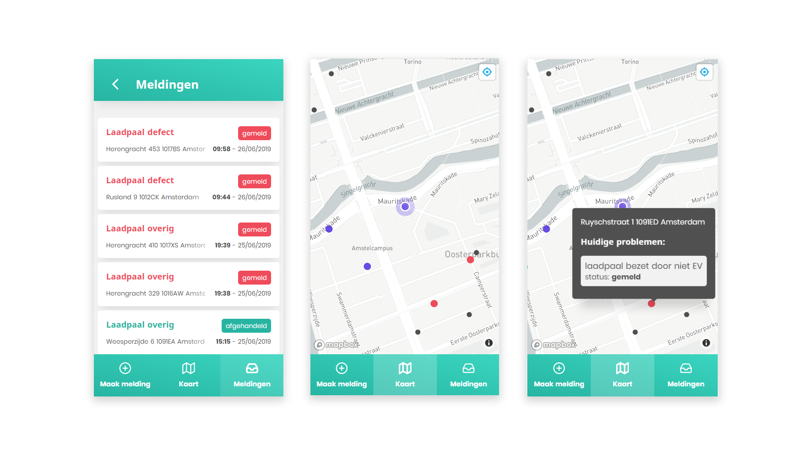
From left to right:
1. Overview of submitted issues by user and the status of the issues
2. Map overview of all charging stations nearby and their statuses
3. Detail tooltip about specific charging station

### Dashboard
#### Overview map of all charging stations in Amsterdam with their status
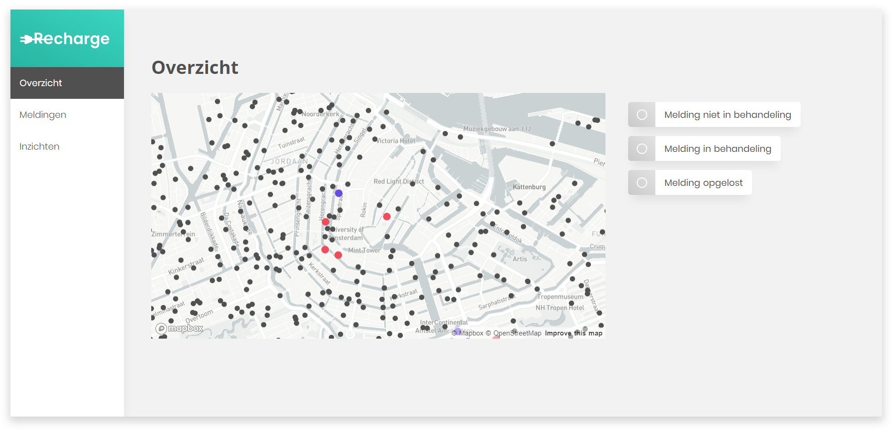

#### Overview of all submitted issues per related organization
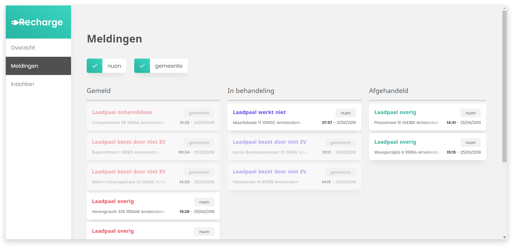

#### Graphs showing insights based on the data provided by the system
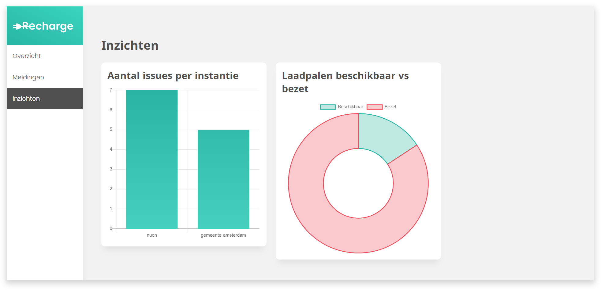

---

## Nice to haves
We got most functionalities that we planned on having in our interactive prototype working. Here are some features we still like to implement:
### Nice to haves - application
- If problem doesn't have a flow, open a chat connection
- Actually navigating to a nearby working charging station

### Nice to haves - dashboard
- Reacting to chats from users provided via the application
- Detail page of issue showing all info provided by the user
- More insights

---

## Recommendations
As this is a proof of concept, it's not build for specific edge cases.

- In this proof of concept we've assumed all submitted issues are real. How do you handle fake issues?
- What kind of insights would be valuable to the organizations? We've not been able to meet with any of them, so this would be an interesting conversation to have.

---

## Conclusion

t.b.w.

---

## Links
// product biography etc
