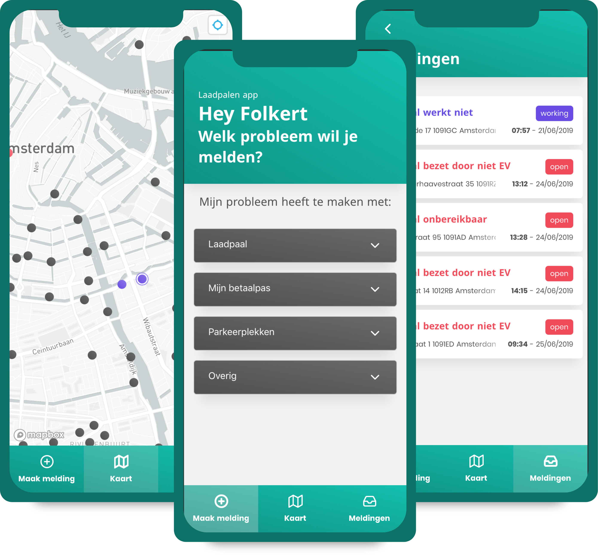
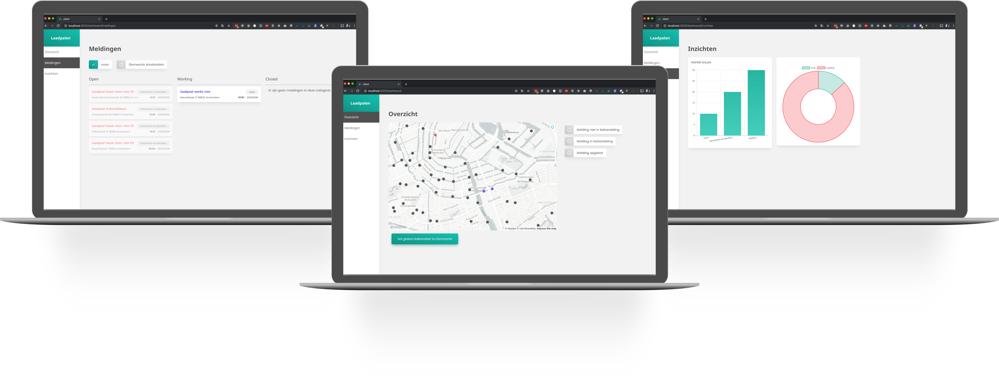
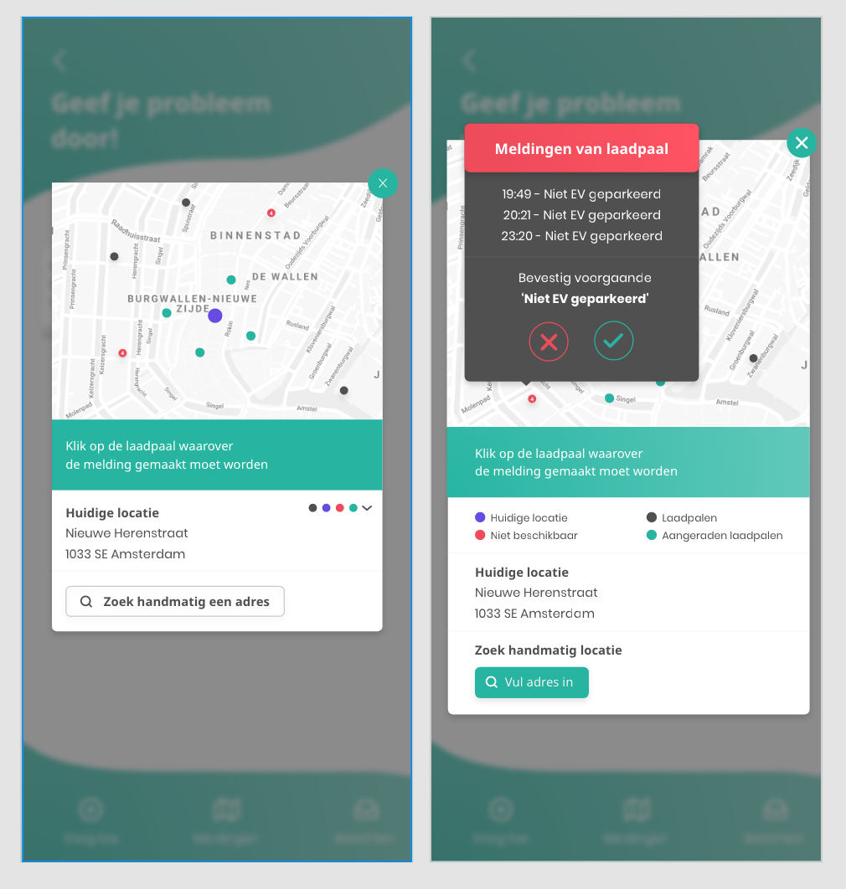
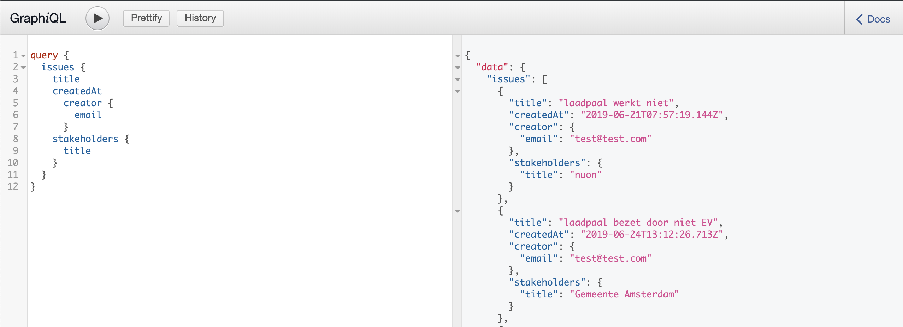
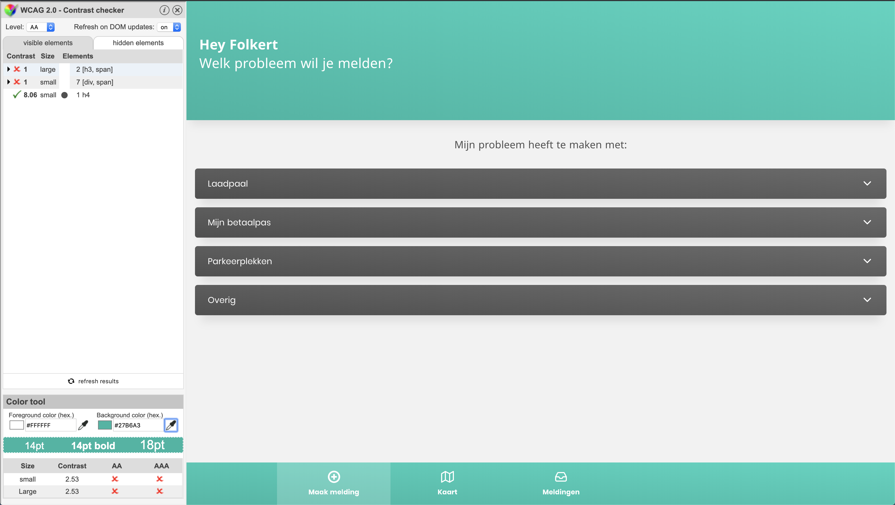

# Recharge product biography

| Client screens                               | Dashboard screens                                  |
| -------------------------------------------- | -------------------------------------------------- |
|  |  |

# Introduction

During the minor webdevelopment at AUAS we got the possibility to work with Jurjen Helmes from the data sience minor during our 'Meesterproef'. Jurjen asked us to create an (web)application to provide users with a place they can leave their complaints and get feedback on their input. Because,according to Jurjen, to make sure Amsterdam will be a city free of emissions, the current problems that EV (Electric Vehicles) users experience need to be taking seriously. When these complains could be measured and geographic points of problems can be created, they can take action and create solutions to these problems that occur often.

# Week 1 concepting & setting up

The first week of the 'Meesterproef' was all about exploring the possibilities and get a better understanding of what the product should be about and what it would atleast need to contain.

The key points that came out of this meeting were that the app atleast should contain a good solution to let users leave their complaint in a user friendly way. We got loads of information about all the stakeholders and what their roles were inside the world of EV in Amsterdam.
Due to this information we got about all the stakeholders the first thing I thought of was creating a dashboard with an overview for every stakeholder so they can see problems that are meant for them in particular.

After the presentation I formed a team with Dennis Wegereef and Folkert-Jan van der Pol.

## Setting up project management tools

The first thing I did when we got out of the meeting was creating an action plan, this first existed of setting up a base for managing our upcoming tasks. I chose Zenhub for this, as it has a nice integration with github and slack and because I have used this in the past. So this was an easy choice to make. After all, we could have also used the integrated project management tool in Github, but Zenhub had some nice integrations with chrome and also dedicated boards with all the tasks, integrated in github. So there were loads of places you could update the tasks from.

I started filling the task board with the tasks we need to finish, the reason behind a setup like this is to get insight in all the aspects that should be taken in consideration.

## Gaining insight in all aspects of the app

The day after the presentation we started working on mapping out all of the different aspects of our app and decide what functionalities we should include. Together with Folkert and Dennis we build feature and whish list, a word map per stakeholder. This resulted in a base for the structure of our project. Creating big overviews per small part of the application results in better insight and in our case also a great foundation for the application.

## Designs

Folkert and Dennis were mostly busy with designing in Adobe XD, I took a more informative role in this and gave multiple times my feedback and advise. This would most of the time result in us sitting next to eachother and trying every possibility we could come up with.

Most of my feedback I gave was about usability and user improvements. And example of this would be to not hide elements that should be visible or could be visible.



In the image above I noticed that we had explanation of the colors hidden behind a dropdown in the very first sketch and my solution was to show the color with explanation whenever there was room to do so.

All the designs of this week van be found through the following links:

[Client app wireframes](https://xd.adobe.com/view/200df57a-f938-47e7-62e4-16f374a24c3d-563c/)

[Dashboards app wireframes](https://xd.adobe.com/view/200df57a-f938-47e7-62e4-16f374a24c3d-563c/)

## Tech stack

The reason for me to stay a bit back from the designs was that I wanted to focus more on the backend of the application, so I started to dive into multiple solutions that could fit our application. Based on the insights we gained from mapping out the data we needed, what features the application would hold and what whises there were, I could create a pretty detailed datamodel mockup in the first week and start looking for fitting solutions.

# Week 2

In the second week Dennis and Folkert were most of the time busy with finishing up the designs and create a solid design prototype that we could show Jurjen. This went very well and Jurjen got very enthousiastic.

I was focussing on the backend tasks and finding ways to create a robust server setup that would fit our application well. After searching for a while I came to the conclusion that a server side API created with GraphQL and Typescript would be a very great foundation of our server. Not only do GraphQL and Typescript fit eachother well, the languages are also part of my learning goals that I wanted to focus on.

GraphQL and Typescript are both Typed languages, which means the outcome of for example a parameter will be declared beforehand, this way you will always know what the result will contain.

In this week I spend many hours picking up GraphQl with reading articles and following Academind on youtube. These two combined resulted in the following setup that I started using.

- Express for the server, with express-graphql to expose the GraphiQL interface.
- MongoDB Atlas as a database and hosting service.
- Tsc as a Typescript compiler

Most of this week I was busy with learning to write GraphQL queries and integrating Typescript in it.

## Feedback designers

During this week, Folkert also setup a meeting with two designers that pointed out some problems we had in the prototype, like the fact that there was too much unused space and some actions should be displayed in a better way. This was mostly design focussed but it was also very useful to witness how the designers looked at our project.

# Week 3

In the third week I finally got a hang on the project and finished many articles and videos about GraphQl and it was time to create more customized actions and start splitting my code and implementing our data modal.

The way I splitted my code for a modular GraphQL setup were:

- GraphQl folder

  - Resolvers folder

    - index.ts including all the resolvers

  - Schema folder
    - index.ts, including all the scheme's of the project

- Models folder

  - Model files

- Middleware folder
  - Authentication files

## Queries

The way I made my issues was by first declaring them inside the Schema folder like this:

```js
type Issue {
  _id: ID!
  title: String!
  description: String!
  creator: User
  category: Category!
  location: String,
  status: String
  polenumber: Int!
  createdAt: String!
  messages: [Message!],
  history: [History!],
  image: String
  stakeholders: Stakeholder!
  loadingstation: Loadingstation!
  confirmed: Int
}
```

The inside the same file, in the same folder, I could add them inside my RootQuery,

```js
type RootQuery {
  issues: [Issue!]!
}
schema {
  query: RootQuery
  mutation: RootMutation
}
```

The RootQuery is an object containing all the query functions that could be accessed when you post a query to the server. The `[Issue!]!` means that as well as the object can not be null as the array can not be nullable. This way you prevent returning empty arrays.

When you would call a query you could do it like the example below:


## Mutations

Mutations are a way to modify data in the database. The great thing about mutations is that you can create new values for the database and instantly returning the results you want to get after you created them.

The way you create a new mutation is almost the same as creating a new Query type. The difference is, instead of creating a type, you are declaring an input.

```js
input IssueInput {
  title: String
  description: String
  location: String
  status: String
  polenumber: Int
  createdAt: String
  image: String
  confirmed: Int
  stakeholderId: String
  loadingstationId: String
}

```

The other difference is also that you don't declare any array of types that it could contain, but instead pass `id's` that can will reference other types.

and then you can make it accessible by adding it to the schema.

```js

type RootMutation {
  createIssue(issueInput: IssueInput): Issue
}
schema {
  query: RootQuery
  mutation: RootMutation
}
```

**note** that we return the type `Issue` when we created an issue, this results in that the created issue can be accessed as a callback.

**Note:** these are just the schema setups, you also need to create resolvers and models for each type of input you declare.

## Resolvers

The schema by itself doesn't do anything, it is just a reference to functions that can be called. Inside the resolver folder I created an `issues.ts` which holds exports like these:

```js
type issueObject = {
  id: string;
  title: string;
  location: string;
  status: string;
  createdAt: string;
  creator: string;
  image: string;
  stakeholders: string;
  loadingstation: string;
};

issues: () => {
  // Find all the issues in the database
    return IssueModel.find()
      .then((issues: issueObject[]) => {
        // Map over all the issues and pass them to the transform function
        return issues.map((issue: issueObject) => {
          // Pass the issue to the transformIssue function which gathers any relations and returns a complete object with relations.
          return transformIssue(issue);
        });
      })
      .catch((err: string) => {
        throw err;
      });
  },
```

The `transformIssue` where the data gets passed to is part of the `merge.ts` file, which includes functions to merge relations into eachother.

```js
const transformIssue = (issue: any) => {
  return {
    ...issue._doc,
    _id: issue.id,
    createdAt: new Date(issue.createdAt).toISOString(),
    creator: user.bind(this, issue.creator),
    messages: messages.bind(this, issue._doc.messages),
    stakeholders: stakeholder.bind(this, issue.stakeholders),
    loadingstation: loadingstation.bind(this, issue.loadingstation)
  };
};
```

You can see in the function above that return the complete object but add relations to the object we return. For example we will take the creator function.

```js
const user = (userId: string) => {
  return User.findById(userId)
    .then((user: any) => {
      return transformUser(user);
    })
    .catch((err: string) => {
      throw err;
    });
};
```

The User function find the string that gets passed into it and tries to find the user in the database by id. After it is found it will return the result, which again as a transform because an user can also have issues etc. This results in that you could get the creator of an issue and then again the issues of that user, because every relation gets merged.

## Models

The last part of making the query and mutation work I created a model for the issues, due to the fact it is very long I will just take a small snippet.

```js
title: {
    type: String,
    required: true
  },
  ...
   creator: {
    type: MongooseSchema.Types.ObjectId,
    ref: "User"
  },
```

This is where you also Type the results of GraphQL and make references to other models and make it possible to merge based on id's.

## Feedback

This week was also the first week I did have a feedback sessions with Laurens, in which I talked about my progress and learning goals. The feedback on the product was very good, not very much complaints about it, there was more feedback on additional features we should implement to create a more dynamic application.

This feature was using real-time web inside our project, and this was already my goal so this was a nice confirmation that it would be a good addition.

# Week 4

This week was about mergin the server and client together and fix bugs that would occur. Some things we ran into were that there was only and add function and not a update function. So this was one of the things I implemented in this week.

The flow is eventually the same as creating a new issue, but this took an extra id to reference the right function that needs to be updated. The function would look like this:

```js
updateIssue(id: String, issueInput: IssueInput): Issue!
```

And the update functionality looks like this:

```js
 updateIssue: async (args: any) => {
   // Find the id inside the issue collection in the database
    const issues = IssueModel.find({ _id: { $in: args.id } });
    return issues.map((issue: any) => {
      // Create keys based in the issue input
      const keys = Object.keys(args.issueInput);
      // For each input field that has been provided with a value, update the key with the new value. This also support creating new keys if it not exists yet.
      for (let i = 0; i < keys.length; i++) {
        const key = keys[i];
        issue[0][key] = args.issueInput[key];
      }

      return issue[0]
        .save()
        .then((res: any) => {
          // After saving it to the database, return the object
          return { ...res._doc };
        })
        .catch((err: string) => {
          throw new Error(err);
        });
    });
  },
```

## Creating real time components

As we have merged the projects I could now create a socket connection between the server and the client.

For this I created a basic setup in the root of our server and a class component which holds all the socket functionalities.

```js
const { SocketController } = require("./sockets/sockets");
const sockets = new SocketController();

io.on("connection", (socket: any) => {
  console.log("User connected");

  socket.on("issue created", (data: any) => {
    console.log("issue created", data);
    io.sockets.emit("issue has been created", data);
  });

  sockets.createdIssueSocket(socket, io);
  sockets.updatedIssueSocket(socket, io);

  socket.on("disconnect", () => {
    console.log("user disconnected");
  });
});
```

The socket controller would exist out of multiple functions and could be scale with ease.

```js
export class SocketController {
  createdIssueSocket(socket: any, io: any) {
    socket.on("issue created", (data: any) => {
      console.log("issue created", data);
      io.sockets.emit("issue has been created", data);
    });
  }
  updatedIssueSocket(socket: any, io: any) {
    socket.on("issue has been updated", (data: any) => {
      console.log("issue has been updated", data);
      io.sockets.emit("issue status has been updated", data);
    });
  }
}
```

At the client side the sockets were called in this way:

```js
import socketIOClient from "socket.io-client";
const socket = socketIOClient(this.endpoint);
socket.on("issue has been created", issue => {
  this.notificationTrigger = true;
  this.message = "Nieuwe melding gemaakt:";
  this.issue = issue.title;
  this.status = issue.status;
  this.issue.location = issue.location;

  this.$store.commit("INCREMENT_MESSAGES_NOTIFICATIONS");

  setTimeout(() => {
    this.notificationTrigger = false;
  }, this.timeout);
});
```

The code above is about notifications that will be triggered when the status of an issue has been changed.

The sockets listen to eachother based on the message that has been communicated from and to the server, this way we can manually trigger actions whenever we liked.

# Week 5

The last week of the project was all about finishing up the products. As Folkert and Dennis were busy focussing on the last points of the application, I started to focus on the accessability of the website and used the color blindness and WCAG tool to check for issues.



There were not many problems on the home screen, but there was a lack of hierarchy and the color brought not enough contrast to display white letters.

So, it turned out we came .5 short of getting the right contrast, so I changed the color from `#27B6A3` to `#27B5A2`, which ended up at a contrast of 3.07 and passing the AA webstandards for readability.

The complaint buttons turned out to be made of `div` so I changed all the occurances that contained a `@click` event to `button` so that every device could tab through the application.
There was also a lack of visual feedback when you tabbed on an item, for this I restored the outline property in css and made it our according to our theme colors.

# Reflection

```

```
